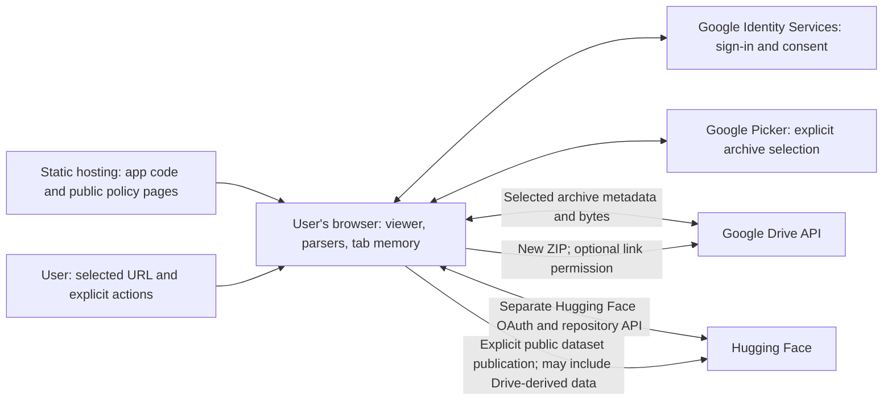

# Google OAuth verification packet

Prepared **2026-10-04** for **ColmapView**, maintained by **OpsiClear LLC**. Support and privacy contact: **info@opsiclear.com**. This is a reviewable submission draft, not evidence of Google approval or a completed submission.

The technical account below describes the current integration and its dated setup evidence. The initial custom deployment uses source `c450566`; its exact browser checksum check exposed a Cloudflare analytics injection, with an HTML-only fix prepared for the next deployment. Review the exact final deployed build before submitting. Domain verification, production audience and branding status are separate facts, recorded below.

**Hosting update — 2026-10-05:** the prepared system keeps GitHub Pages independent and enables Google Drive only on **`https://colmapview.opsiclear.com/`**, hosted separately through Cloudflare Pages. The GitHub and Pages-preview profiles explicitly disable Drive. Google's current verification instructions require DNS verification of a Search Console **Domain property** for `opsiclear.com`; the earlier GitHub HTML-file/URL-prefix plan below is historical and insufficient for that requirement. The new workflows, artifact tests and canonical URLs are preparation, not evidence of deployment, verified ownership, real consent or Google approval. See [dual-host setup](dual-hosting.md).

## Live setup audit — 2026-10-04

**Later setup confirmed — 2026-10-06 UTC:** separate production project **`colmapview-prod-20261006`** now has Drive+Picker enabled, a Web client with exact JavaScript origin `https://colmapview.opsiclear.com`, and a browser key restricted to both APIs and referrers `https://colmapview.opsiclear.com/*` and `https://docs.google.com/*`. Sole declared scope: `drive.file`. After confirming Publish app, its audience is **External / Production**; the Testing test-user allowlist no longer controls this production audience. Verification Center explicitly reports that scope verification is not required because the app requests no sensitive or restricted scopes. Branding saved the canonical custom-origin URLs `/about`, `/privacy` and `/terms`, but Verification Center says branding is not being shown to users. No Verify/Publish branding control was available in the observed Branding page; published/verified branded consent remains pending. Google consent support uses available project-owner identity `opsiclear@gmail.com`; public support/privacy remains `info@opsiclear.com`. The development project remains Testing.

Search Console Domain property **`opsiclear.com` reports Ownership verified** under production-project owner `opsiclear@gmail.com`, using the new DNS TXT proof. The owner's Cloudflare account controls the domain; Pages projects `colmapview-opsiclear` and `colmapview-preview` exist with production branch `main`. The associated custom domain/CNAME reports **Active** and public DNS A records resolve. Initial custom upload `c450566` serves the viewer and public policy pages with HTTP 200; the browser seal check caught a Cloudflare Web Analytics beacon absent from the prepared HTML. The next build's narrow HTML `no-transform` headers must be deployed and rechecked. Google's dashboard confirms the numeric production project number matches the configured Picker app ID. Configuration is stored in ignored local files and corresponding GitHub settings; no credential values are included here. `CLOUDFLARE_PAGES_ENABLED=false`. The custom HF callback is registered and separate build flags enabled, with rebuilt deployment and real HF login pending. **Real private Google consent/Picker/publication rehearsal and published/verified Google branding remain unproven.** Confirm final authorized-domain/contact fields and deployed client/API behavior.

The original table below is a historical development-project audit; it does not describe the new production-intended project's saved configuration.

| Item | Observed live state |
| --- | --- |
| Google Cloud project | `colmapview-drive-20261004`, named **ColmapView**. |
| Audience | **External / Testing**. Test users: `opsiclear@gmail.com` and `yehe@opsiclear.com`; the latter was added and verified during this setup. |
| Branding | Homepage, privacy-policy, and terms fields are empty. Authorized domain: `colmapview.github.io`; this entry alone does not prove verified ownership. |
| Earlier Search Console proof | Google's native HTML file was downloaded unchanged to [`public/google4291c25c9a09eab6.html`](../public/google4291c25c9a09eab6.html), but no deployment or Verify action occurred. This URL-prefix proof does not meet the current DNS Domain-property requirement. The superseded release root-copy step has been removed; verify the owned `opsiclear.com` domain through DNS instead. |
| Google contact fields | User support selector and developer contact currently use `opsiclear@gmail.com`. `info@opsiclear.com` is the supplied public support/privacy contact, not a confirmed selectable Google support identity. |
| Data Access | **Only `drive.file` is now saved.** The old `drive.readonly` declaration was removed. After saving, the live Data Access page showed the `drive.file` row, no `drive.readonly` row, and a disabled Save button. This aligns the Testing declaration with the archive/Picker implementation; ZIP and TAR use the same per-file permission. It is not production approval. |
| Drive and Picker API setup | Drive API and Google Picker API are enabled. The existing browser API key's saved restrictions were reopened and confirmed to allow both APIs; the existing app and localhost website referrers remain, and `https://docs.google.com/*` was added for the Picker iframe. |
| Picker app ID | The numeric project number is configured as local `VITE_GOOGLE_DRIVE_APP_ID` and saved in repository variable `GOOGLE_DRIVE_APP_ID`, with the repository value verified. No key or credential value is included in this packet. |
| OAuth clients | One Web application, **ColmapView browser**, created 2026-10-04. Its full ID matches `VITE_GOOGLE_DRIVE_CLIENT_ID` in the local app at `http://localhost:5173`, confirmed by comparison without publishing the ID or credentials. This does not establish the deployed build's client configuration. |
| Client origins and redirects | Authorized JavaScript origins: `https://colmapview.github.io` and `http://localhost:5173`. No authorized redirect URIs are registered; the implemented browser token flow uses an origin and popup. |
| Verification Center | Reports no review required while the app remains in Testing. This is not production approval. |
| Public deployment | `/latest/` returns HTTP 200, but still includes Analytics and lacks the prepared `strict-origin` referrer policy. `/latest/about.html`, `/latest/privacy.html`, `/latest/terms.html`, and `/latest/policy.css` return HTTP 404. |

**Prepared:** app changes, policy pages, justification drafts, demonstration script and deployment tests. Separate projects, production APIs/client/key, matching numeric Picker app ID, saved Branding fields, verified DNS ownership, active custom domain, initial app/policy upload and Production audience are established above. **Pending:** deployment and exact browser verification of the HTML-preservation fix, published/verified Branding as required, deployed client/API checks and real consent/private-file/publication rehearsal. Scope verification is explicitly not required; Production audience does not establish verified branding.

**Earlier ZIP validation:** before adding TAR to Drive loading, focused integration tests and 47 mocked browser checks passed for private selection and public URL loading with the real synthetic 48-point/two-image ZIP, including desktop and 390/320-pixel layouts. The real Google Picker SDK loaded successfully while preserving Google Identity Services' namespace. These results establish neither TAR coverage nor a real authorization grant/private file selection. New archive-format checks and live example results are recorded below. Real production OAuth/Picker consent and private-file selection remain pending.

**Current ZIP/TAR validation:** 55 browser checks passed using mocked Google Identity Services, Picker, and Drive responses, with **real native libarchive decoding** of synthetic archives. Tested private ZIP on desktop, private TAR at 390 pixels, private TAR.gz at 320 pixels, public TAR on desktop, and public TAR.gz on desktop. Each loaded the actual 48-point/two-image reconstruction. Focus, cancellation, token handling, canonical references, and anonymous public loading without OAuth also passed. The scoped suite passed **287 tests across 25 files**; lint and the fresh production build containing the archive changes passed.

**Live public TAR sample:** the user's provided Drive link returned anonymous metadata HTTP 200 for a downloadable `application/x-tar` file of **1,649,626,624 bytes**. The updated app's Drive resolver accepted that exact sharing URL and metadata as a supported archive without fetching the full media. A real media range request returned HTTP 206; its sampled 512-byte USTAR header had a valid checksum. This confirms metadata validation, public media access, and a valid sampled header, **not** successful full-archive decoding or rendering. The complete 1.65 GB file was not downloaded or rendered. No real private Google authorization or Picker selection has been proven by these checks.

Google's OAuth policy requires separate Cloud projects for development/testing and production. The audited Testing project currently contains both localhost and public origins; it is not established as a production-ready project. Set up the final production project/client separately from development, then confirm the deployed app uses that configuration before review. [Google OAuth project-separation policy](https://developers.google.com/identity/protocols/oauth2/policies)

Google's support-email selector accepts an eligible registered Google account or a Google Group managed by the signed-in user. To select `info@opsiclear.com`, use that registered Google/Workspace identity with project owner/editor access and sign in as it, or an eligible managed Group; do not assume an arbitrary mailbox can be typed into the selector. Keep public contact wording accurate while this setup is pending. [Google Branding requirements](https://support.google.com/cloud/answer/15549049?hl=en)

## Copyable application fields

| Field | Prepared value |
| --- | --- |
| Application name | ColmapView |
| Maintainer | OpsiClear LLC |
| Public support/privacy email | info@opsiclear.com |
| Google user support email | Saved available owner identity: `opsiclear@gmail.com`; public support `info@opsiclear.com` is not currently selectable |
| Developer contact email | Prepared: info@opsiclear.com; confirm final production contact field before submission |
| Application homepage | `https://colmapview.opsiclear.com/about` (saved canonical value) |
| Privacy policy | `https://colmapview.opsiclear.com/privacy` (saved canonical value) |
| Terms of service | `https://colmapview.opsiclear.com/terms` (saved canonical value) |
| Production Drive viewer | `https://colmapview.opsiclear.com/` |
| Independent GitHub viewer | `https://colmapview.github.io/latest/` (Google Drive disabled) |
| Production authorized domain | `opsiclear.com`; DNS Domain property verified, confirm final authorized-domain entry before review |
| Production JavaScript origin | `https://colmapview.opsiclear.com` (no path); production Web client registered |
| Production Google Cloud project | `colmapview-prod-20261006`, External / Production; scope verification not required, branded consent not published |
| Proposed application category | Productivity and education: interactive visualization and inspection of user-selected 3D reconstruction datasets |
| Google APIs | Google Drive API v3 and Google Picker API |
| OAuth client type | Web application using Google Identity Services' browser token model |
| Audited JavaScript origins | Historical development client: `https://colmapview.github.io` and `http://localhost:5173`; production uses only the exact custom origin above. Origins do not include `/latest/` |
| Audited Google Cloud project ID | Development `colmapview-drive-20261004` remains External / Testing; production is separate |
| Audited OAuth client | **ColmapView browser**, full ID matched to the local app; include every client retained in the final review project in the demonstration |
| Picker application ID | Final production project's numeric project number; repository variable `CUSTOM_GOOGLE_DRIVE_APP_ID` maps to `VITE_GOOGLE_DRIVE_APP_ID` in the custom profile. Local testing retains its separate `VITE_` configuration |
| Demonstration video | Pending recording; use [the prepared script](oauth-review-demo-script.md) if Google requests feature evidence or for the production rehearsal |

The extensionless custom-root URLs are the saved Branding values for the HTML pages in `public/`; Pages canonicalizes the corresponding `.html` links to these same-host routes. Initial custom pages return HTTP 200. Main-branch deployment updates GitHub `/dev/` without provider authentication; an enabled tag deployment updates GitHub `/latest/` and the custom root from the same SHA. DNS ownership, active custom domain, separate production configuration and Production audience are established above; exact final browser artifact verification and real client/data-access checks remain pending.

For the current Google OAuth process, use Search Console's **Domain** property `opsiclear.com`, publish Google's exact TXT value in that domain's DNS, and verify with an eligible owner of the production Cloud project. Record the actual result and confirm Google's accepted authorized-domain entry. A URL-prefix property, public HTML proof file, entered domain or successful website HTTP check does not establish this DNS Domain-property verification. The prepared GitHub HTML file may remain a historical artifact; the release workflow no longer copies it to the GitHub host root. [Google's current domain-verification instructions](https://support.google.com/cloud/answer/13804266?hl=en)

The public About homepage links to Privacy and Terms. In the viewer, the version badge opens Help → About, which contains the public-page links; touch users reach the same tab through Help. Privacy and Terms are also available in the loading account dialogs before sign-in. The dataset-loading panel has no policy-link row.

### Application description

> ColmapView is a browser application for viewing and inspecting COLMAP 3D reconstructions, cameras, images, masks, and Gaussian splats. Users can open a reconstruction from local files, a supported archive, or a dataset URL. The Google Drive integration accepts pasted public ZIP and TAR links, including compressed TAR, without sign-in. For a private archive, the user signs in and explicitly selects that file through Google Picker with the per-file drive.file permission; the account must already be permitted to download it. Pasting an arbitrary private URL does not authorize it. Previously selected or app-created archives can open by URL with a connected per-file session. Users can also export the dataset currently open in the viewer as a new ZIP in their own Drive, privately by default, and explicitly enable link sharing. Publishing creates ZIP output, not TAR. Google downloads and uploads connect directly between the browser and Google's API. Optional publication to Hugging Face creates a public dataset only after the user chooses that destination and confirms publication. Non-Drive local and remote sources retain their existing supported archive formats, including 7z.

### Eligibility explanation

The proposed category is supported by the app's primary interactive viewer: users manipulate and inspect their chosen reconstruction, rather than granting background access for a general file service. This is a proposed fit, not a Google determination. Google's Drive policy permits productivity and education use cases, but also prohibits certain uses including backing up app content to Drive and using Drive as a CDN. The reviewer must evaluate the actual dataset export/publishing behavior as well as viewing. Describe it accurately; do not recast export as backup/sync or conceal publishing to make the application seem eligible. [Google Workspace policy](https://developers.google.com/workspace/workspace-api-user-data-developer-policy)

## Permissions and exact justification drafts

The prepared implementation requests only the Google scope below; reconcile the declared scope with the exact reviewed build. The Google integration does not request Google `openid`, `email`, `profile`, `drive.readonly`, or full-Drive access. Loading and publishing use separate in-memory authorization sessions, both with `drive.file` and `include_granted_scopes: false`.

| Scope | Classification | Current use |
| --- | --- | --- |
| `https://www.googleapis.com/auth/drive.file` | Non-sensitive | Read the ZIP or TAR archive explicitly selected through Google Picker or previously available to the app; create, upload, verify, retry, and optionally share a new ZIP created by ColmapView. |

The classifications and per-file scope behavior follow [Google's Drive scope reference](https://developers.google.com/workspace/drive/api/guides/api-specific-auth).

### `drive.file` justification

> ColmapView works with particular ZIP and TAR datasets using only files authorized for this application or created by it. A user signs in from the Drive account control and clicks Choose archive from Drive to select an existing private archive through Google Picker. Picker provides the selected file's ID, filename, and optional resource key. The loader validates its metadata and downloads the file before parsing and rendering the reconstruction in the browser. ZIP filenames receive a ZIP signature check; TAR and compressed TAR are handled by the existing libarchive parser. Public archive links use anonymous requests. An arbitrary private sharing URL does not authorize the file for the app; the user must first select it through Picker unless it is already available to the app. The loader does not modify source files or request broad Drive access.

> When a user clicks Publish to Google Drive, ColmapView requests the same per-file scope in its publishing session. The user chooses a ZIP name and starts Save private dataset or Publish shared dataset. ColmapView packages the current reconstruction, original images, available masks, active splat, and viewer settings in the browser. It creates a new Drive ZIP, uploads through a resumable session, and reads the created file's metadata to verify size and checksum and reconcile retries. If the user explicitly selects Anyone with the link can view, it adds an anyone-reader permission with file discovery disabled after verifying the upload. The application's Drive account permission ID keeps retries tied to the same account. It does not overwrite unrelated files or automatically delete files. Full-Drive access is unnecessary and is not requested.

This selected-file design follows Google's minimum-scope guidance and `drive.file` recommendation for specific-file applications. Removing `drive.readonly` from the implementation and live declarations avoids restricted-scope verification for this integration. The earlier URL-only broad-read justification is superseded and must not be submitted for the new build. Non-sensitive scope classification does not itself establish application eligibility, completed branding, or production approval. [Requesting minimum scopes](https://support.google.com/cloud/answer/13807380?hl=en)

## Actual data flow and retention

The static host serves HTML, JavaScript, WASM, and policy pages. It is not a dataset download relay or an OAuth-token backend. Opening a shared viewer link sends its page URL, including the dataset URL in the query string, to the hosting service; this can appear in its request logs. A safe referrer policy limits onward referrers but does not hide this initial request from the host. Hosting and provider services also receive their own ordinary connection/request information. A client-only architecture is not a claim that no third party receives data.

| Data or operation | Current handling and boundary |
| --- | --- |
| Google authorization | On the explicitly enabled custom production origin (or separately configured local development), the app lazily loads `https://accounts.google.com/gsi/client` when a Google account or publisher control opens. Disabled GitHub/Pages origins block SDK/API access before network and offer an explicit custom-host link. A user click starts Google's token popup for `drive.file`. The code keeps only an access token and expiry in the current tab's JavaScript memory. It has no refresh-token or client-secret storage. |
| Google Picker | The app loads `https://apis.google.com/js/api.js` and Google's Picker module for explicit Choose archive from Drive selection. Picker receives the current Google token, same-project browser API key and numeric project number, and viewer origin. Its interface selects one ZIP or TAR archive, including compressed TAR. Filename validation accepts `.zip`, `.tar`, `.tar.gz`, `.tgz`, `.tar.bz2`, `.tbz2`, `.tbz`, `.tar.xz`, and `.txz`, ignoring case. The app uses the validated file ID, filename, and optional resource key; it does not trust a returned download URL. Cancel does not start a load. |
| Private Drive reading | After per-file authorization, requests go to fixed HTTPS `www.googleapis.com/drive/v3/files/{id}` endpoints. Metadata is limited to `id,name,mimeType,size,capabilities(canDownload),trashed`. File bytes use `alt=media`. An optional resource key is forwarded to Google. Authorization is in request headers, not viewer links. Pasted private URLs require a file already available to the connected app. |
| Drive publication | Uses `about?fields=user(permissionId)`, generated file IDs, resumable ZIP uploads, app-owned operation markers, and size/checksum/permission verification. New files are private by default. Explicit sharing adds anyone-reader access. Uploaded files and their permissions remain in the user's Drive until changed there. |
| Viewer dataset | Parsed reconstruction, images, archive contents, and prepared uploads are handled by the viewer and its in-memory caches. A disconnect does not remove an already downloaded scene. Reloading or closing the tab discards its authentication and viewer/upload state. Browser HTTP caches, downloads, and history are separate and may persist. |
| Browser preferences | Viewer settings, theme, profiles, and last-seen version use local storage. A URL auto-load crash guard temporarily records the attempted dataset URL in session storage and removes it when loading settles; a hard crash may leave the record. A viewer link can include a dataset sharing URL and appear in browser history. Tokens are not included in those records. |
| Hugging Face | Separate OAuth with PKCE uses `openid profile read-repos` for private reading and adds `contribute-repos` for publishing. The app retains its username and token in tab memory. Private repository content may download with the authorized session. Current publishing creates a **public** repository and uploads dataset files, preview, and a dataset card; files can become public before the upload finishes. |
| Transfers between providers | A user can publish a Drive-loaded archive's current dataset to a new public Hugging Face repository. A user can also save data read from Hugging Face to a new Drive ZIP. These are separate, explicit publication actions; the original source's permissions are unchanged. Do not transfer real private material in review demonstrations. |
| Analytics and telemetry | This preparation removes the app's automatic Google Analytics tag. Confirm that the submitted production bundle has no remaining app analytics integration. Owner must separately review any historical analytics property's retained data and account settings; removing the tag does not delete old records. Do not put dataset URLs, names, tokens, or content in analytics, reports, screenshots, or debug uploads. |

Google's browser token model documents the client-side authorization approach. [Token model](https://developers.google.com/identity/oauth2/web/guides/use-token-model)

The dataflow must remain accurately disclosed: user-selected Drive data can still be sent to Hugging Face by explicit publication. The new Google integration requests only non-sensitive `drive.file`, so restricted-scope verification and its security assessment are not required on account of this scope. This conclusion relies on the exact production build and declarations having no restricted Google scopes; it is not a blanket browser-only exemption or a claim of approval. Scope expansion requires a fresh policy and review assessment. [Drive scope classifications](https://developers.google.com/workspace/drive/api/guides/api-specific-auth)

### Disconnect, revoke, and delete

- **Forget a local connection:** use Disconnect in the loading account dialog and Sign out in the publishing dialog. They clear different Google sessions; clear both when connected to both. Publisher sign-out cancels the active upload. These controls do not revoke the Google account's authorization grant or erase a loaded scene.
- **Revoke Google authorization:** open [Google Account connections](https://myaccount.google.com/connections), select ColmapView's access to the Google account, and remove access. This is separate from local sign-out. [Google's account-access instructions](https://support.google.com/accounts/answer/13533235?hl=en)
- **Clear local viewer data:** close the tab and clear the site's data in the browser. Delete downloaded exports separately and remove unwanted dataset URLs from history. Site-data removal clears locally saved settings and profiles too.
- **Remove published material:** review the receipt's real provider link. Delete/trash the ZIP in Drive or change its sharing there; delete the repository or change visibility in Hugging Face as appropriate. Cancelling or signing out does not undo already committed content or sharing. Public copies acquired by other people cannot be recalled by ColmapView.
- **Ask the maintainer for help:** contact info@opsiclear.com with the issue and only the minimum identifying information. Do not email access tokens or private datasets. The maintainer should explain provider/local deletion steps and handle any material voluntarily sent for support under the published privacy policy.

## Owner submission procedure

1. Finalize the operator/contact information and review the public pages. Deploy the real production build containing these pages and privacy disclosures. Confirm all three canonical URLs return public content without login.
2. Add Search Console **Domain** property `opsiclear.com` using an eligible production Cloud project owner, publish Google's exact DNS TXT value through the domain's DNS host, and use Verify. Record the actual Domain-property result, then confirm `opsiclear.com` is accepted in production authorized domains. The old GitHub HTML/URL-prefix proof is insufficient for Google's current OAuth domain instructions. [Domain verification](https://support.google.com/cloud/answer/13804266?hl=en)
3. Establish separate Cloud projects for development/testing and production. In each appropriate project enable **Google Drive API** and **Google Picker API**, use a matching web OAuth client and numeric project number, and restrict the browser API key to both APIs and the necessary viewer referrers plus `https://docs.google.com/*` for Picker. Production uses the exact origin `https://colmapview.opsiclear.com`; configure `CUSTOM_GOOGLE_DRIVE_CLIENT_ID`, `CUSTOM_GOOGLE_DRIVE_API_KEY`, and `CUSTOM_GOOGLE_DRIVE_APP_ID` from that separate production project. The custom profile explicitly enables only that origin; GitHub and preview profiles clear Drive configuration. In the final production project's **Google Auth Platform → Branding**, enter the prepared name, eligible monitored support identity, developer contact, custom-root URLs, `opsiclear.com` authorized domain, and actual project logo if used. Run **Verify Branding**, address issues, then **Publish branding** when ready. [Project separation](https://developers.google.com/identity/protocols/oauth2/policies), [Branding workflow](https://support.google.com/cloud/answer/15549049?hl=en), [Picker API-key setup](https://developers.google.com/workspace/drive/picker/guides/web-picker-sample)
4. Review **Audience**, the production client's exact origins, and the deployed app's client configuration. Move the production OAuth audience out of Testing when ready for review; this alone does not mean the app or scopes are verified. Keep development clients in the separate testing project and include every client retained in the production project in the review evidence. Do not delete clients blindly.
5. In **Data Access**, declare only `drive.file` and remove any old `drive.readonly` entry. Confirm both loading and publishing request only `drive.file`, private ZIP/TAR selection uses real Picker, and public pasted archive links load anonymously. A saved scope declaration is not approval. The sole non-sensitive scope does not require sensitive/restricted-scope Data Access verification. If Google requests additional evidence, use the prepared description and demonstration of each retained production client; record the complete genuine consent and selected-file workflow. [Data Access instructions](https://support.google.com/cloud/answer/15549135?hl=en)
6. Complete any required **Verification Center** branding or application review for the actual production configuration. Submit only requested, accurate material, monitor owner/editor email, and answer Google's eligibility or configuration questions. Do not submit the superseded restricted-scope justification or claim that non-sensitive scope selection completes Google's other requirements. [Submission instructions](https://support.google.com/cloud/answer/13461325?hl=en)

The dated audits record project separation, configured production APIs/client/key, matching numeric Picker app ID, saved Branding fields, verified DNS Domain-property ownership, active custom domain, initial app/policy upload and Production audience. Google explicitly reports scope verification is not required. The HTML-preservation redeployment and exact browser check, published/verified Branding as required, deployed client/API checks and real OAuth/Picker/publication rehearsal remain pending; verified Google branding is not claimed.

### Relevant documentation links for the review form

Use up to three feature explanations, adjusting the branch/ref to the exact reviewed release:

1. [Drive ZIP/TAR loading with Picker](https://github.com/ColmapView/colmapview.github.io/blob/main/docs/google-drive-loading.md)
2. [Drive ZIP publication](https://github.com/ColmapView/colmapview.github.io/blob/main/docs/google-drive-publishing.md)
3. [Hugging Face publication](https://github.com/ColmapView/colmapview.github.io/blob/main/docs/hugging-face-publishing.md)

## Readiness checklist

Checked items describe prepared source/material, not a deployed or approved app.

- [x] Identified maintainer and monitored support/privacy contact: OpsiClear LLC, info@opsiclear.com.
- [x] Prepared app description, scope-specific justification, actual data flow, retention boundaries, and deletion/revocation guidance.
- [x] Prepared an English demonstration script using disposable synthetic data.
- [x] Updated prepared policies and justification for Drive ZIP/TAR reading through Picker and `drive.file`-only publishing; retained the distinction from future prototype features.
- [ ] Owner review and acceptance of the homepage, privacy policy, terms, and in-product disclosures.
- [ ] Deploy the policy pages and matching application to the final production host; verify HTTP status, navigation, canonical URLs, and support links.
- [x] Earlier local production build confirmed the analytics removal, origin-only referrer policy, static policy pages, and self-hosted font. Confirm the final deployed build matches; historical analytics retention still requires owner review.
- [x] Passed the fresh production build containing the ZIP/TAR Picker changes. Initial custom upload serves the app and policies; exact browser verification caught Cloudflare analytics injection and awaits the HTML-only header fix deployment.
- [x] Recorded the earlier unchanged GitHub HTML proof as URL-prefix evidence only; removed the superseded release root-copy step and corrected the DNS Domain-property procedure.
- [x] Published the new DNS TXT proof; Search Console Domain property `opsiclear.com` reports Ownership verified under production-project owner `opsiclear@gmail.com` on 2026-10-06 UTC. This is domain verification, not Google app approval.
- [ ] Confirm Google's accepted authorized domain; register matching final domains and origins.
- [x] Audited the live project, audience/test users, Branding fields, contacts, earlier scope declarations, Testing verification status, and public deployment on 2026-10-04.
- [x] Confirmed the audited Testing project's live Data Access contains only `drive.file`; removed `drive.readonly` and rechecked the saved page. Local loading and publishing now request only `drive.file`.
- [x] Compared the listed client's full ID to the local app configuration and inspected both authorized origins and the empty redirect-URI list.
- [x] Created separate production project `colmapview-prod-20261006`, enabled Drive/Picker, registered the exact custom Web-client origin and stored restricted browser configuration.
- [x] Confirmed Publish app and Production audience; Verification Center explicitly says sensitive/restricted scope verification is not required. Branded consent remains unpublished and the real private-file rehearsal is pending.
- [ ] Confirm the actual deployed production client's ID/API behavior and final contacts; real private consent and publication are not proven by configuration.
- [x] Confirmed the current Testing project's Drive/Picker APIs and saved key restrictions to both APIs and existing app/local referrers plus `https://docs.google.com/*`; configured the numeric Picker app ID locally and verified the repository variable.
- [x] Configured the separate production APIs/client/browser key with saved Drive+Picker restrictions, custom-origin referrers and `https://docs.google.com/*`, and stored the custom build settings without publishing credential values.
- [ ] Verify the deployed client, numeric Picker app ID and key work together through real consent/Picker on the final custom origin.
- [x] Earlier ZIP-only implementation passed focused local tests and 47 mocked browser checks using the synthetic ZIP; loaded the real Picker SDK without replacing the GIS namespace. This historical result does not establish TAR coverage.
- [x] Passed 55 mocked-Google browser checks with real native libarchive decoding of synthetic ZIP, TAR, and TAR.gz datasets on desktop/390/320-pixel layouts; each reconstructed 48 points and two images. Scoped tests: 287 passed across 25 files. Lint passed.
- [x] Checked the provided public Drive TAR's anonymous metadata and HTTP 206 media header sample with a valid USTAR checksum. The full 1.65 GB archive was not downloaded or rendered.
- [ ] Complete the live OAuth/Picker test with user consent and a real authorized private archive selection. SDK loading and mocks do not establish this result.
- [ ] Rehearse real OAuth and Picker on the exact production build, including private archive selection, cancellation, public pasted links, and ZIP publication; record complete English evidence if Google requests it.
- [ ] Publish verified Branding and complete any review Google requires; sole non-sensitive `drive.file` does not need restricted-scope verification or its assessment.
- [ ] Resolve Google's application eligibility and any remaining production configuration questions.

**Excluded from this review claim:** Drive folder loading/publishing, HF ZIP publication, and HF private publication exist only in the design prototype. Do not show that prototype as the review application or request scopes justified by those future features.

## Source evidence in this checkout

- [`auth.ts`](../src/features/googleDrive/auth.ts): sole per-file Google scope, lazy Google Identity Services library, separate memory-only sessions, consent requests, expiry, and local disconnect.
- [`picker.ts`](../src/features/googleDrive/picker.ts): numeric project number, explicit single-archive selection, Google-hosted SDK, selected-file validation, cancellation, and session checks.
- [`api.ts`](../src/features/googleDrive/api.ts): selected file metadata/content requests, public-first access, fixed download endpoint, download/size validation.
- [`upload.ts`](../src/features/googleDrive/upload.ts) and [`publishDataset.ts`](../src/features/googleDrive/publishDataset.ts): account permission ID, resumable upload, new-file operation marker, verification, sharing, retry, and cancellation behavior.
- [`GoogleDrivePublishModal.tsx`](../src/components/modals/GoogleDrivePublishModal.tsx): private default, explicit sharing/publication actions, remaining-file warning, sign-out behavior.
- [`hubClient.ts`](../src/features/huggingface/hubClient.ts) and [`PublishDatasetModal.tsx`](../src/components/modals/PublishDatasetModal.tsx): current public HF destination and explicit publication warnings.
- [`huggingface/auth.ts`](../src/features/huggingface/auth.ts), [`migration.ts`](../src/store/migration.ts), and [`urlLoadAttemptGuard.ts`](../src/utils/urlLoadAttemptGuard.ts): HF scopes/tab session, local preferences, and session URL crash guard.

Policy and process sources were checked against Google's and Hugging Face's official documentation on 2026-10-04. Recheck them before submission; code changes require the description, policies, dataflow, and recording to be updated together.
